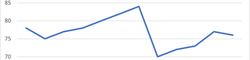

# Gramex Narratives narrate insights from data

Given the data for this NPS time series:

| Month | NPS |
|-------|----:|
| Jul   |  84 |
| Aug   |  70 |
| Sep   |  72 |
| Oct   |  73 |
| Nov   |  77 |
| Dec   |  76 |

... this library returns an array with 3 strings:

1. NPS fell by 1.3% from 77 to 76.
2. It reversed a 3 month growth trend.
3. It's the highest degrowth in 3 months.

## Narratives _focus_ on and _explain_ what's important

Why do we need narratives?

**Why not tables?** Tables show raw information. But most people can't interpret numbers well. Narratives **explain** what to take away.

**Why not charts?** Charts show many patterns. But most people just pick patterns they're familiar with. Narratives **focus** on the most important ones.



For example, in the chart above, most people focus on the big drop in August. But in monthly updates, the **recent** drop is most important.

**What about domain/context?** Context is important when narrating. But there are common patterns across datasets that you can use as a starting point, and then customize.

## Narratives supports most dataset types

The dataset types planned for support:

1. **TODO**: **Series**: e.g. population by country. It has a number (population) and a label (country) whose order does not matter. Charts: **bar**, **column**, **lollipop**, **isotype**, **pie**, **donut**.
2. **TODO**: **Ordered Series**: e.g. population by age group. It has a number (population) and a label (age group) whose order matters. Charts: **bar**.
3. [**Time Series**](docs/timeseries.md): e.g. population by year. It has a number (population) and a label (year) that has uniform intervals. Charts: **line**, **area**, **sparkline**.
4. **TODO**: **Weighted Series**: e.g. growth vs sales. It has a 2 number (growth and sales). One shows performance (growth) and another shows size or priority (sales). Charts: **treemap**, **marimekko**
5. **TODO**: **Bivariate**: e.g. weight and age by class. It has 2 numbers (weight and age)  that we want to relate and a label (class). Charts: **scatter plot**.
6. **TODO**: **Matrix**: e.g. population by country and age group. It has a number (population) and 2 labels (country, age group) whose order does not matter. Charts: **table**, **heatmap**, **stacked bar**, **stacked column**.
7. **TODO**: **Multi Time Series**: e.g. population over year by country. It has a number (population) and a label (year) that has uniform intervals, and a label (country) that may or may not have a natural order. Charts: **multi-line**, **multi-area**, **slope**.
8. **TODO**: **Range Series**: e.g. project start and end dates. Charts: **waterfall**, **spine**, **Gantt**, **candlestick**, **seismogram**.

## Dataset types need their own analysis

Each dataset type has a `model(data)` that returns the analysis as an object.

This is dataset type specific.
For example, Time Series calculates trends, but Series doesn't.
Bivariate calculates correlations but Range Series does't.

## Dataset types have default narratives

Each dataset type has a `narratives` array -- a "narrative" list, like this:

```js
  {
    template: ({ growth, prev, last, value }) => `${value} remained at ${num(last)}.`,
    if: ({ growth }) => growth === 0,
  },
```

Each narrative is an object with these properties:

- `template`: a function that accepts the model and returns a string
- `if`: a function that accepts the model and returns a boolean. If it's `false`y, the narrative is skipped.
- `priority`: an optional function that accepts the model and returns a number. Higher priority is rendered first. **TODO**
- `sentiment`: an optional function that accepts the model and returns a number (-1, 0, 1). Negative is considered bad news and positive is considered good. This is used for conjunctions and negations. **TODO**


## Format for readability

[`formats`](docs/formats.md) has functions to format numbers, dates, etc. for readability.

For example, `formats.num(3.1415)` returns `3.14` and `formats.num(1000000)` returns `1M`.

## Calibrate for emotion

**TODO**

## Synonyms break monotony

**TODO**

## Usage

Use this script to generate the above output.

```html
<script type="module">
import { narrate, timeseries } from "node_modules/narratives/narratives.mjs";

const data = [
  { month: "Jan", NPS: 78 },
  { month: "Feb", NPS: 75 },
  { month: "Mar", NPS: 77 },
  { month: "Apr", NPS: 78 },
  { month: "May", NPS: 80 },
  { month: "Jun", NPS: 82 },
  { month: "Jul", NPS: 84 },
  { month: "Aug", NPS: 70 },
  { month: "Sep", NPS: 72 },
  { month: "Oct", NPS: 73 },
  { month: "Nov", NPS: 77 },
  { month: "Dec", NPS: 76 },
];
const model = timeseries.model(data, { time: "month", value: "NPS" });
const story = narrate(model, timeseries.narratives)
console.log(story);
</script>
```

## Build setup

```shell
git clone git@github.com:gramener/gramex-narratives.git narratives/
cd narratives/
npm install
npm run build
npm publish
```
