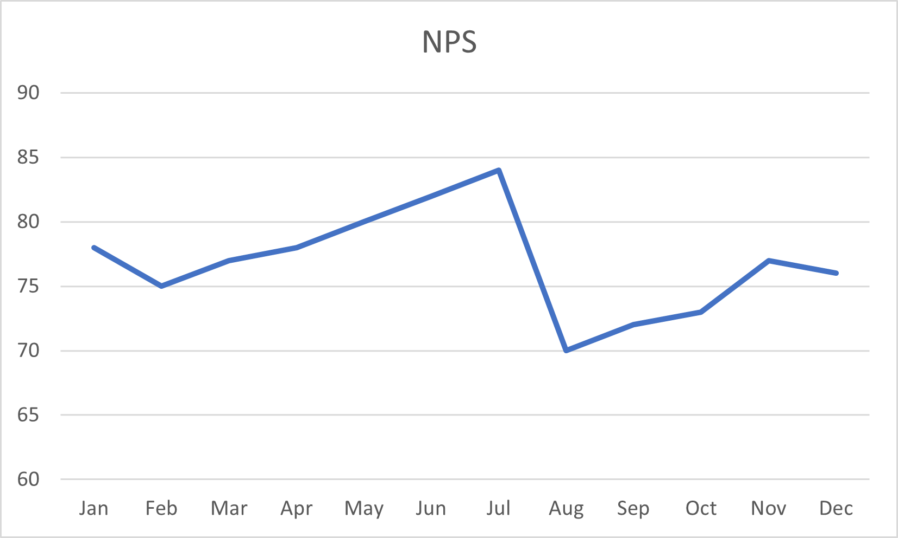

# Gramex Narratives

Gramex Narratives analyze data and share insights in words.

For example, given the data for this NPS time series:



... it says:

> NPS fell by 1.3% from 77 to 76.
> It reversed a 3 month growth trend.
> It's the highest degrowth in 3 months.

Use this script to generate the above output.

```html
<script type="module">
import { narrate, timeseries } from "node_modules/narratives/narratives.mjs";

const data = [
  { month: "Jan", NPS: 78 },
  { month: "Feb", NPS: 75 },
  { month: "Mar", NPS: 77 },
  { month: "Apr", NPS: 78 },
  { month: "May", NPS: 80 },
  { month: "Jun", NPS: 82 },
  { month: "Jul", NPS: 84 },
  { month: "Aug", NPS: 70 },
  { month: "Sep", NPS: 72 },
  { month: "Oct", NPS: 73 },
  { month: "Nov", NPS: 77 },
  { month: "Dec", NPS: 76 },
];
const model = timeseries.model(data, { time: "month", value: "NPS" });
const story = narrate(model, timeseries.narratives)
console.log(story);
</script>
```

## Build setup

```shell
git clone git@github.com:gramener/gramex-narratives.git narratives/
cd narratives/
npm install
npm run build
npm publish
```
