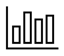
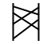

# Dynarrate: Narrate dynamic data

[**DYNARRATE'S PURPOSE**](docs/purpose.md) is to help dashboard authors automate chart titles and takeaways, even when data is dynamic.

[It's a **FRAMEWORK**](#pick-a-dataset-type) to pick narratives for your dashboard,
[AND a **LIBRARY**](#library-usage) to automate these rules in JavaScript.

## Pick a dataset type

### Series

E.g. population by country. It has a number (population) and a label (country) whose order does not matter.




### [Ordered Series](docs/orderedseries.md)

E.g. population by age group. It has a number (population) and a label (age group) whose order matters.


### [Time Series](docs/timeseries.md)

E.g. population by year. It has a number (population) and a label (year) for time.

[](docs/timeseries.md)
[](docs/timeseries.md)
[](docs/timeseries.md)
[](docs/timeseries.md)

### Weighted Series

E.g. growth vs sales. It has a 2 number (growth and sales). One shows performance (growth) and another shows size or priority (sales).


### Bivariate

E.g. weight vs age or budget vs target. It has 2 numbers (weight and age) that we want to relate.


<!--

Multi-bivariate: colored scatterplot
Weighted bivariate: bubble chart

-->

### Matrix

E.g. population by country and age group. It has a number (population) and 2 labels (country, age group) whose order does not matter.


### Time Matrix

E.g. population by country over year. It has a number (population), a label (country) whose order does not matter, and a label (year) for time.




### Range Series

E.g. project start and end dates.


## Each has a model and narratives

Each dataset type has a `model` that takes the data and returns calculated values. For example:

- Time Series calculate trends, but Series don't.
- Bivariates calculate correlations but Range Series don't.

Each dataset type has a list of `narratives`. Each narrative has 4 parts:

- `template`: a function that takes the model and returns a string
- `if`: a function that takes the model and returns false to skip the narrative, and true to include it
- `priority`: an optional function that takes the model and returns a priority number. Higher priority is rendered first. **TODO**
- `sentiment`: an optional function that takes the model and returns a number. -1 is bad news, +1 positive is good. This helps conjunctions and negations. **TODO**

Utilities make the narrative output more readable:

- [`format`s](docs/format.md) make numbers, dates, etc. more readable. For example, `format.num(3.1415)` returns `3.14` and `format.num(1000000)` returns `1M`.
- Calibration convey emotion **TODO**
- Synonyms break monotony **TODO**

## Library usage

Given this dataset:

| Month | NPS |
| ----- | --: |
| Jul   |  84 |
| Aug   |  70 |
| Sep   |  72 |
| Oct   |  73 |
| Nov   |  77 |
| Dec   |  76 |


... this library returns an array with 3 strings:

1. NPS fell by 1.3% from 77 to 76.
2. It reversed a 3 month growth trend.
3. It's the highest de-growth in 3 months.

Use this script to generate the above output.

```html
<script type="module">
  import { narrate, timeseries } from "node_modules/narratives/narratives.mjs";

  const data = [
    { month: "Jan", NPS: 78 },
    { month: "Feb", NPS: 75 },
    { month: "Mar", NPS: 77 },
    { month: "Apr", NPS: 78 },
    { month: "May", NPS: 80 },
    { month: "Jun", NPS: 82 },
    { month: "Jul", NPS: 84 },
    { month: "Aug", NPS: 70 },
    { month: "Sep", NPS: 72 },
    { month: "Oct", NPS: 73 },
    { month: "Nov", NPS: 77 },
    { month: "Dec", NPS: 76 },
  ];
  const model = timeseries.model(data, { time: "month", value: "NPS" });
  const story = narrate({ ...model, minGrowth = 0.005 }, timeseries.narratives)
  console.log(story.map(v => v.text).join(" "))
</script>
```

`narrate()` returns a `story` object which is an array of narrative objects:

```js
[
  { text: "NPS fell by 1.3% from 77 to 76.", name: "growth" },
  { text: "It reversed a 3 month growth trend.", name: "runs" },
  { text: "It's the highest degrowth in 3 months.", name: "maxGrowth" },
];
```

## Build setup

```shell
git clone git@github.com:gramener/gramex-narratives.git narratives/
cd narratives/
npm install
npm run build
npm publish
```
