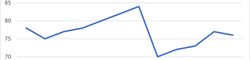

# Dynarrate automates takeaways from dynamic data

## Dashboards need narrative takeaways that explain and focus

**Why not just show tables?** Tables show raw information. Most people can't interpret numbers well. Narratives **explain** what to take away.

**Why not just show charts?** Charts show many patterns. But most people just pick patterns they're familiar with. Narratives **focus** on the most important ones and drive decisions.

For example, in the chart above, most people focus on the big drop in August. But in monthly updates, the **recent** drop that reversed a 4-month growth trend is more important. It's important to **say it explicitly**.

## But dynamic data is hard to narrate automatically

Dashboards are often based on dynamic data. Dashboard authors don't know before-hand

- what all patterns users might see in the data
- which of those are most important, and therefore the takeaways

## This framework picks narratives across all patterns

For each dataset type, this narrative framework

1. List every possible narrative pattern or **TEMPLATE**.
2. Identifies **IF** the pattern is relevant for the data (e.g. "it reversed a trend" is relevant only if the latest value dipped while past values grew, or vice versa)
3. Assigns a **PRIORITY** to each pattern, based on data (e.g. a once-a-year event is more important than a once-a-month event)
4. Assigns a **SENTIMENT** to each pattern, i.e. is this good news or bad news

By applying every template, filtering out irrelevant ones, sorting by priority and grouping by sentiment, this framework picks the most important takeaways.

You can implement in any language (Excel, Tableau, Power BI, Python, etc.) It has a reference JavaScript implementation you can use directly.

## But it's not perfect

**CONTEXT IS MISSING**. It focuses only on what the data says. We may not know that "Dec reversed a 4-month growth trend _because of inflation_" if it's not in the dataset.

But dashboards can't go beyond data. End users will find these patterns from data a good starting point to build on.
